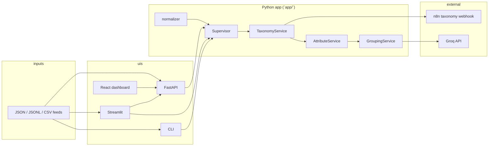

# Catalog enrichment dashboard — team handoff

This repository is a **catalog enrichment pipeline** plus **operator UIs**. Raw merchant or marketplace-style product rows go through normalization, **taxonomy mapping** (external webhook), **category-aware attribute extraction**, and **family or variant grouping** (rules plus optional **Groq** LLM). Outputs are rich JSON records aligned to an internal `CanonicalProduct` shape, suitable for review, export, or downstream publishing.

The same orchestration logic is used from:

- a **FastAPI** HTTP service (primary integration surface),
- a **React** browser dashboard (Vite),
- an optional **Streamlit** dashboard (`app/ui/review_dashboard.py`),
- a **CLI** (`python -m app.main`) for batch runs and terminal color review.

---

## 1. High-level architecture



**Important behavior:** **variant and family grouping only merge SKUs that appear in the same batch** (same HTTP request body or same CLI batch). Splitting a large feed into multiple API chunks means SKUs in different chunks are **not** grouped together in that run. This is documented in code for `CATALOG_ENRICHMENT_CHUNK_SIZE` and the CLI `--batch-size` flag.

---

## 2. Repository layout

| Path | Role |
|------|------|
| `app/core/canonical_model.py` | **Pydantic** schema for the enriched product (`CanonicalProduct`). Single source of truth for field names used across pipeline and APIs. |
| `app/core/normalizer.py` | Maps many raw feed shapes (Amazon-like, generic merchant keys) into the dict fields expected by `CanonicalProduct`. |
| `app/orchestrator/supervisor.py` | **Orchestrator**: batch order is normalize all → taxonomy batch → attributes per item → grouping batch → schema mapping (placeholder) → validation (placeholder). |
| `app/services/taxonomy_service.py` | POSTs to configurable **n8n webhook**; applies `mapped_category` / `path`, `confidence`, `categoryId(s)`; chunked requests; SSL verify flag; title-based **fallback** on failure. |
| `app/services/attribute_service.py` | Picks attribute set from `category_attribute_config` + `attribute_config`; strategies include color (text + vision path), regex (size, RAM, storage), direct (brand). Writes `provenance.review.color` when color needs manual review. |
| `app/services/grouping_service.py` | Per-SKU family name (LLM-first or hybrid), `family_signature`, deterministic `group_id`, `variant_axes` from differing variant attrs or **LLM**; fills `variants` sibling list. |
| `app/core/grouping_strategies/` | `llm_grouping.py` (family name), `variant_axes_llm.py` (axes when rules find none). |
| `app/core/llm/groq_client.py` | Groq client; reads `GROQ_API_KEY` from environment or repo-root `.env`. |
| `app/core/attribute_strategies/` | Color detection helpers (`color_strategy`, `llm_color`). |
| `app/config/` | `settings.py` (FastAPI app name, prefix), `category_attribute_config.py`, `attribute_config.py`. |
| `app/api/` | FastAPI app: `main.py`, `schemas.py`, `routes/catalog.py`, `routes/health.py`. |
| `app/main.py` | **CLI**: batched pipeline, optional interactive color review, writes `data/output_products.json`. |
| `app/ui/review_dashboard.py` | **Streamlit** UI; can call FastAPI (`catalog_api_client`) or in-process `Supervisor` via `CATALOG_USE_FASTAPI`. |
| `app/utils/` | `storage.py`, `review_actions.py`, `review_queue.py`, `catalog_api_client.py`. |
| `frontend/` | **React + Vite** dashboard; calls FastAPI only (`VITE_API_BASE`). |
| `data/sample_input.json` | Example input array for local testing. |
| `color_map_shoes_clean.py` (repo root) | Imported by shoe color image path in `color_strategy`; keep on `PYTHONPATH` when running from repo root (default for `uvicorn` / `streamlit` from root). |

---

## 3. Core data model (`CanonicalProduct`)

The enriched record is a **flat-ish JSON-serializable object** (Pydantic `model_dump()` everywhere). Fields your teammate will see most often:

- **Source:** `source_product_id`, `source_system` (inferred in normalizer if omitted).
- **Raw:** `raw_title`, `raw_description`, `raw_features`, `raw_images`, `raw_categories`, `raw_price`, `raw_brand`; `normalized_title`.
- **Taxonomy:** `predicted_taxonomy` — typically `{ path, confidence, category_id, category_ids }` after webhook (path may mirror n8n’s `mapped_category`).
- **Attributes:** `attributes` (all extracted), `identity_attributes`, `variant_attributes` (splits driven per category in config).
- **Grouping:** `family_name`, `family_signature`, `group_id`, `variant_axes`, `variants` (list of `{ source_product_id, variant_attributes }` for siblings in the same group).
- **Buckets for future work:** `content`, `media` — present on model; standalone HTTP stages return **501** today.
- **Quality / provenance:** `quality` (e.g. `grouping_confidence`, `variant_axes_source`); `provenance` (e.g. `review.color`, `grouping_fallback`, `variant_axes_llm`).

---

## 4. Pipeline stages (batch)

Implemented in `Supervisor.run_batch_pipeline`:

1. **Normalize** each raw dict → `CanonicalProduct`.
2. **Taxonomy** — webhook batch (chunk size from env); fallback per item on chunk errors.
3. **Attributes** — per product, after taxonomy path is known.
4. **Grouping** — across the **whole batch list** passed in (not across separate API calls).
5. **Schema mapping** — **placeholder** (no-op aside from verbose log).
6. **Validation** — **placeholder** (no-op aside from verbose log).

**HTTP-layer validation** (stages like `ready` / `blocked` / `needs_review`) is computed in `app/api/routes/catalog.py` from taxonomy confidence and `provenance.review`, not from a deep validation engine yet.

---

## 5. How to run locally

### Python environment

From the repo root, create a virtualenv and install dependencies from **`req.txt`** (FastAPI stack, Groq, Streamlit, `webcolors`, and packages used by optional shoe image color in `color_map_shoes_clean.py`). `urllib3` is pulled in via `requests` for taxonomy SSL handling.

```bash
pip install -r req.txt
```

Set **`GROQ_API_KEY`** (see `.env.example`) before running flows that call Groq. For reproducible deploys, consider exporting a lockfile (`pip freeze` / `uv pip compile`) from this list.

### FastAPI (required for React and recommended for Streamlit)

```bash
uvicorn app.api.main:app --reload --host 127.0.0.1 --port 8001
```

- OpenAPI: `http://127.0.0.1:8001/docs`
- Health: `GET /api/v1/health` (prefix from `API_PREFIX`)

### React dashboard

```bash
cd frontend
npm install
npm run dev
```

Default UI assumes API at `http://127.0.0.1:8001` or `VITE_API_BASE` from `.env.local` (see `frontend/.env.example`).

### Streamlit

```bash
streamlit run app/ui/review_dashboard.py
```

Sidebar: API base URL, toggle FastAPI vs local `Supervisor`, file upload (JSON / JSONL / CSV).

### CLI batch

```bash
python -m app.main --input data/sample_input.json --batch-size 5 -v
```

Writes **`data/output_products.json`**. Optional `--full` prints full JSON per product.

---

## 6. HTTP API summary (`/api/v1/catalog/…`)

| Method | Path | Behavior |
|--------|------|----------|
| POST | `/enrichment/run` | Full pipeline; returns `products` + `validations`. |
| POST | `/taxonomy/predict` | Normalize + taxonomy only. |
| POST | `/attributes/extract` | Normalize + taxonomy + attributes. |
| POST | `/family/group` | Through grouping (no standalone validation list beyond product shape). |
| POST | `/quality/validate` | Deterministic checks on **payload you send** (no upstream calls). |
| POST | `/content/enrich`, `/media/enrich`, `/publish` | **501** — not implemented. |

Request body: `{ "items": [ { ...raw product... } ], "verbose": false }`.

---

## 7. Configuration and secrets

Copy **`.env.example`** to **`.env`** at repo root for local development. Notable variables:

| Variable | Purpose |
|----------|---------|
| `TAXONOMY_WEBHOOK_URL` | n8n (or compatible) POST URL for category mapping. |
| `TAXONOMY_WEBHOOK_BATCH_SIZE` | Items per webhook POST (sequential chunks). |
| `TAXONOMY_WEBHOOK_TIMEOUT` | Per-request timeout (seconds). |
| `TAXONOMY_VERIFY_SSL` | Default `false` for internal self-signed certs. |
| `GROQ_API_KEY` | Required when LLM paths run (grouping family name, variant axes, color LLM if used). Loaded by `groq_client` from env or `.env`. |
| `GROUPING_FAMILY_NAME_SOURCE` | `llm_only` (default) or `hybrid` (rule title first, LLM under confidence threshold). |
| `GROUPING_LLM_FALLBACK_THRESHOLD` | Used in hybrid mode (default `0.75`). |
| `GROUPING_MERGE_BY_FAMILY_NAME_KEY` | When no `category_id`, whether to merge by stable family key (default true). |
| `VARIANT_AXES_LLM_ENABLED` | Default true — Groq may infer axes when rule-based axes are empty. |
| `API_PREFIX`, `APP_NAME`, `APP_ENV` | FastAPI metadata and route prefix. |
| `CORS_ORIGINS` | Comma-separated origins; empty uses Vite defaults in `app/api/main.py`. |
| `CATALOG_API_BASE_URL`, `CATALOG_USE_FASTAPI` | Streamlit defaults. |
| `CATALOG_ENRICHMENT_CHUNK_SIZE` | Split Streamlit’s remote enrichment into multiple POSTs; **grouping is per chunk**. |

The repo default taxonomy URL is a **non-routable placeholder**; set **`TAXONOMY_WEBHOOK_URL`** in `.env` (see `.env.example`) for your real n8n or taxonomy service endpoint.

---

## 8. Operational caveats (share these explicitly)

1. **Batch boundaries = grouping boundaries.** Same product line split across CLI batches or API chunks will get **different** `group_id`s unless you run one batch containing all siblings.
2. **Taxonomy depends on network** to the webhook; failures trigger **fallback** paths (lower confidence / heuristic).
3. **`apply_review_update`** (`app/utils/review_actions.py`) sets `attributes[attribute]` to a **capitalized string** and clears the matching `provenance.review` key. Color in the pipeline is often a **dict** `{ name, hex }`; CLI/UI reviewers should know that manual fixes may need richer structure if downstream expects objects.
4. **Placeholder stages:** `run_schema_mapping` and `run_validation` in `Supervisor` are intentional stubs for future BRD work.
5. **Groq model** is fixed in `groq_client.py` (`meta-llama/llama-4-scout-17b-16e-instruct`); changing it is a one-line ops decision.

---

## 9. Suggested onboarding order for the new owner

1. Read `CanonicalProduct` in `app/core/canonical_model.py`.
2. Trace one item through `Supervisor.run_batch_pipeline` in `app/orchestrator/supervisor.py`.
3. Read `normalize_raw_data` in `app/core/normalizer.py` for supported input keys.
4. Skim `TaxonomyService._call_service` payload/response mapping (`app/services/taxonomy_service.py`).
5. Skim `AttributeService.extract` and `CATEGORY_ATTRIBUTE_CONFIG` for how categories drive attributes.
6. Read `GroupingService.run_batch` for `family_signature`, `group_id`, and `variant_axes`.
7. Use `data/sample_input.json` + `/docs` **Try it out** on `POST .../enrichment/run` before touching UIs.

---

## 10. Related files not exhaustively listed

- `app/api/schemas.py` — Pydantic request/response models for HTTP.
- `app/utils/review_queue.py` — helpers for collecting review flags (used by Streamlit).
- `frontend/src/productUtils.ts` — mirrors some CLI view and stage logic on the client.

If this document drifts from the code, treat **`Supervisor.run_batch_pipeline`** and **`catalog.py` routes** as the source of truth for behavior and wire-up.
